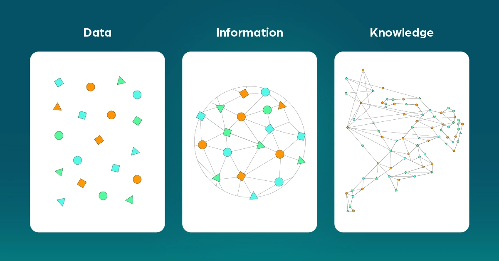

# Introduction

## Data → Information → Knowledge

| Concept | Description |
|:--------|:------------|
| **Data** | Raw facts with no meaning yet. *Example: numbers, text, logs* |
| **Information** | Data after processing and organizing it. It becomes meaningful and useful. |
| **Knowledge** | Deeper understanding extracted from information. It represents **hidden patterns and insights**. |

> **📌 Key Points**
> - **Knowledge = hidden patterns** — When you analyze information and discover patterns, you create knowledge.
> - When you **share knowledge**, it becomes **information for others** (because they receive it as something structured and understandable).
> - You can **process information multiple times**, and it can still remain **information** unless you discover new insights (knowledge).

---

## Database Server

A **DB Server** is a server responsible for storing, managing, and retrieving data efficiently and securely. It **allows multiple users or applications to access the same data simultaneously**, while ensuring consistency, security, and integrity. It is the core of any system that relies on structured data.

### Main Functions

| Function | Description |
|:---------|:------------|
| **Storage** | Store data in **tables** in an organized way |
| **CRUD Operations** | Create, Read, Update, Delete |
| **Transaction Management** | Ensure **data integrity** |
| **Concurrency** | Handle **multi-user access** |
| **Backup & Recovery** | Manage backups and recovery |

---

## Index

An **Index** is a **database object** that exists independently of the table data and **speeds up data retrieval** by providing a fast lookup mechanism, without scanning the entire table. It can be created or dropped without physically affecting the table.

### Types of Indexes

#### B-Tree Index

Most common; good for exact matches or range queries.

> B-trees, short for *balanced trees*, are the most common type of database index. A **B-tree index** is an ordered list of values divided into ranges. By associating a key with a row or range of rows, B-trees provide excellent retrieval performance for a wide range of queries, including exact match and range searches.

---

#### Bitmap Index

Used in OLAP for columns with **low cardinality** (few distinct values, like Gender or Status).

- A Bitmap Index is like a map of bits for each value in a column, which helps the database find rows faster without scanning the entire table.
- In a **bitmap index**, the database stores a bitmap for each index key. In a conventional B-tree index, one index entry points to a single row. In a bitmap index, each index key stores pointers to multiple rows.

**When to use bitmap indexes:**
- The indexed columns have low [cardinality](https://docs.oracle.com/en/database/oracle/oracle-database/19/cncpt/Chunk806120860.html#GUID-5CD22620-6D7A-40DC-BA09-EE3B5339C7F8) (number of distinct values is small compared to table rows).
- The indexed table is either read-only or not subject to significant modification by DML statements.

**Example:** To count all female customers, the database can check the bitmap for 'F' directly instead of scanning all rows.

**Sample Bitmap for One Column**

| Value | Row 1 | Row 2 | Row 3 | Row 4 | Row 5 | Row 6 | Row 7 |
|:-----:|:-----:|:-----:|:-----:|:-----:|:-----:|:-----:|:-----:|
| `M` | 1 | 0 | 1 | 1 | 1 | 0 | 0 |
| `F` | 0 | 1 | 0 | 0 | 0 | 1 | 1 |

A mapping function converts each bit in the bitmap to a rowid of the `customers` table. Each bit value depends on the values of the corresponding row in the table.

For example, the bitmap for the `M` value contains a `1` as its first bit because the gender is `M` in the first row of the `customers` table. The bitmap `cust_gender='M'` has a `0` for the bits in rows 2, 6, and 7 because these rows do not contain `M` as their value.

---

**Sample Bitmap for Two Columns**

| Value | Row 1 | Row 2 | Row 3 | Row 4 | Row 5 | Row 6 | Row 7 |
|:-----:|:-----:|:-----:|:-----:|:-----:|:-----:|:-----:|:-----:|
| `M` | 1 | 0 | 1 | 1 | 1 | 0 | 0 |
| `F` | 0 | 1 | 0 | 0 | 0 | 1 | 1 |
| `single` | 0 | 0 | 0 | 0 | 0 | 1 | 1 |
| `divorced` | 0 | 0 | 0 | 0 | 0 | 0 | 0 |
| `single` or `divorced`, and `F` | 0 | 0 | 0 | 0 | 0 | 1 | 1 |

Bitmap indexing efficiently merges indexes that correspond to several conditions in a `WHERE` clause. Rows that satisfy some, but not all, conditions are filtered out before the table itself is accessed. This technique improves response time, often dramatically.

---

> **ℹ️ Note:** The DB Server creates and maintains the index. Every time data changes (Insert/Update/Delete), the server automatically updates the index.

**Source:** [Oracle Database Concepts - Indexes](https://docs.oracle.com/en/database/oracle/oracle-database/19/cncpt/indexes-and-index-organized-tables.html#GUID-B15C4817-7748-456D-9740-8B9628AF9F47)

---

## Views

They evaluate the data in the tables underlying the view definition **at the time the view is queried**. It is a logical view of your tables, with no data stored anywhere else.

| Aspect | Description |
|:-------|:------------|
| **Upside** | Always returns the latest data |
| **Downside** | Performance depends on the underlying SELECT statement. If it joins many tables or uses non-indexed columns, the view could perform poorly. |

---

## Materialized Views

Similar to regular views (logical view based on a SELECT statement), but the **underlying query result set has been saved to a table**.

| Aspect | Description |
|:-------|:------------|
| **Upside** | Querying a materialized view means querying a table, which may also be indexed. Joins are resolved at refresh time, so you pay the join cost once. With query rewrite enabled, Oracle can optimize queries to read from the materialized view automatically. |
| **Downside** | Data is only as up-to-date as the last refresh. |

**Refresh Options:**
- Manual refresh
- Scheduled refresh
- Automatic refresh based on data changes (using materialized view logs as change data capture sources)

**Use Case:** Materialized views are most often used in data warehousing / business intelligence applications where querying large fact tables with millions or billions of rows would result in unusable response times.

**Source:** [Stack Overflow - Difference between Views and Materialized Views](https://stackoverflow.com/questions/93539/what-is-the-difference-between-views-and-materialized-views-in-oracle)

---

## Different Information Worlds

An organization's information usually exists in **two very different worlds**:

1. **Operational Systems (OLTP – Online Transaction Processing)**
2. **Data Warehouse (OLAP – Online Analytical Processing)**

They may store the same business data, but they serve completely different purposes.

---

### Operational Systems – Where Data Is Created

Operational systems are the systems that run the daily business.

**Examples:**
- Taking orders
- Registering customers
- Logging complaints
- Processing payments

**Characteristics:**
- Built for speed, accuracy, and handling one transaction at a time
- Support repetitive tasks
- Users interact with **one record at a time**

> Think of a cashier scanning one product, or a support agent updating one complaint.

**Goal:** **Execution**, not analysis

**Technical Features:**
- Highly normalized databases (often 3NF)
- Optimized for INSERT, UPDATE, DELETE operations
- Short, fast transactions

> This is the "engine room" of the company.

---

### Data Warehouse – Where Data Is Analyzed

The data warehouse serves a completely different audience.

**Users:**
- Analysts
- Executives
- Managers
- Data scientists

**Typical Questions:**
- How many orders were placed this week vs last week?
- Why did customer churn increase?
- Which product category is growing fastest?

**Requirements:**
- Scanning thousands or millions of rows
- Aggregating data
- Comparing across time
- Summarizing patterns

Users rarely retrieve a single row. They retrieve **patterns across many rows**, and their questions constantly change.

> **Key Distinction:** Operational tasks are repetitive. Analytical questions are unpredictable.

**Goal:** **Understanding**, not execution

---

**Source:** [GeeksforGeeks - Difference between OLAP and OLTP](https://www.geeksforgeeks.org/dbms/difference-between-olap-and-oltp-in-dbms/)

| Aspect | OLTP | OLAP |
|:-------|:-----|:-----|
| **Purpose** | Handling large numbers of transactional operations in real time | Complex queries and data analysis for insights |
| **Focus** | Data consistency and reliability for daily operations | Multidimensional analysis across vast datasets |

 

---

## What is Normalization?

*Normalization* is the process of organizing a database to reduce redundancy and improve [data integrity](https://database.guide/what-is-data-integrity/).

**Source:** [Database.Guide - What is Normalization?](https://database.guide/what-is-normalization/)

---

### Problems of Normalization in OLAP / DWH

| Problem | Description |
|:--------|:------------|
| **Too many joins** | Queries need to combine many tables → slower performance for large datasets |
| **Complex queries** | Harder to write and maintain SQL queries |
| **Not ideal for reporting** | Analytical queries prefer fewer tables → fewer joins = faster scans |

---

## OLTP vs OLAP: Summary

Even if both systems use the same business data, they differ in:

- User type
- Query behavior
- Performance requirements
- Data structure
- Frequency of change

| Aspect | Operational Systems (OLTP) | Data Warehouse (OLAP) |
|:-------|:--------------------------|:---------------------|
| **Focus** | Current state | History |
| **Optimized for** | Writes (INSERT/UPDATE/DELETE) | Reads (SELECT queries) |
| **Transaction type** | Small, fast transactions | Large, complex queries |

> **Key Insight:** This is not just a hardware separation issue. Moving an operational database to another server does not automatically transform it into a data warehouse. If the structure remains transaction-oriented:
> - Queries become complex
> - Joins multiply
> - Performance degrades
> - Business users struggle

> **Bottom Line:** True analytical environments must be designed specifically for analytical needs.
>
> - **OLTP** = "doing the work" (write)
> - **OLAP** = "analyzing the work" (read)