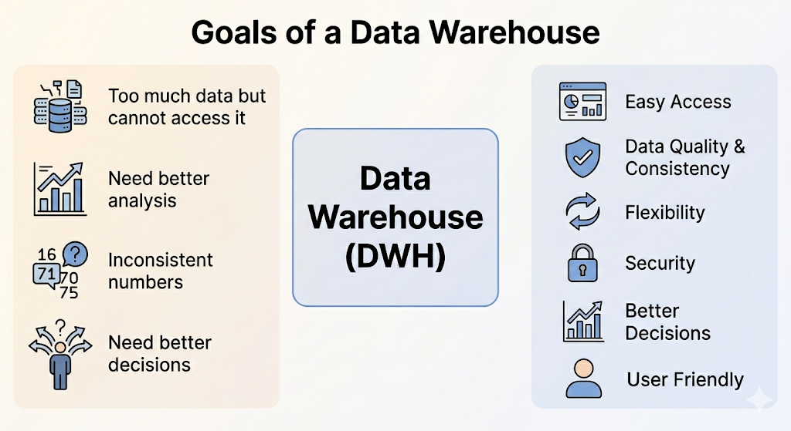

# DWH Goals and Components

## Goals of a Data Warehouse

#### Why do we need a Data Warehouse?

Organizations often say:

- “We have a lot of data, but we can’t access it.”
- “We want to analyze data in different ways.”
- “We need clear and consistent numbers.”
- “We want better decisions based on data.”

These problems define the goals of a Data Warehouse.

#### 1. **Make Data Easy to Access**

- Data should be **simple and understandable** for business users (not بس developers).
- Users should easily **slice and dice** data (analyze it in different ways).
- Tools must be **easy and fast**.

#### 2. **Ensure Data Consistency & Quality**

- Data must be:
    - **Clean, Accurate**
    - **Consistent across the company**
- Same metric name → must have the **same meaning**
- Different meanings → must have **different names**

#### 3. **Handle Change (Flexibility)**

- Business needs always change.
- The DWH should:
    - Adapt easily
    - Add new data without breaking old systems
    - Keep historical data correct

#### 4. **Provide Security**

- Protect sensitive business data
- Control who can access what

#### 5. **Support Better Decision Making**

- Main goal = **help people make better decisions**
- Data Warehouse = **Decision Support System (DSS)**

#### 6. **Gain Business User Acceptance**

- نجاح الـ DWH يعتمد على إن الناس تستخدمه
- لازم يكون:
    - Simple, Useful, Easy to use
    

---

#### **Publishing Metaphor:** *Think of the Data Warehouse Manager like a **magazine publisher***

What does this mean?

- **You don’t just store data**

- **You publish the right data**

---

## Responsibilities

- Understand users and their needs
- Choose the **most useful data**
- Make data **simple and clear**
- Ensure data is **accurate and trusted**
- Update data regularly
- Keep users satisfied

<aside>

#### Focus on **users and business**, not only technology

- Technology = just a tool
- Real goal = **serve business users**
</aside>

---

## Dimensional Modeling Introduction

---

## Components of a Data Warehouse

### 1. Operational Source Systems

- Systems that store **daily transactions (OLTP)**

**Features:**

- Fast for insert/update
- Contains current data (not much history)
- Not for analysis

We only **extract data** from here

---

### 2. Data Staging Area (ETL)

The data staging area of the data warehouse is both a storage area and a set of
processes commonly referred to as extract-transformation-load (ETL). 

The data staging area is everything between the operational source systems and the
data presentation area. It is somewhat analogous to the kitchen of a restaurant,
where raw food products are transformed into a fine meal.

**Steps:**

- Extract → get data
- Transform → clean & fix
    - Data Cleaning
    - Standardization
    - Combine data from multiple sources
    - Deduplication
    - Assigning Keys (surrogate keys)
- Load → prepare for DWH

**What we do:**

- cleaning
- combining data
- remove duplicates
- standardize

Users **cannot access** staging

No queries happen here

Main tasks: clean, combine, deduplicate, standardize

<aside>

### Normalization in Staging?

- Normalized tables can **support ETL**, but:
    - They are **not for users or queries**
    - Once a table is queryable → it becomes part of the **presentation area**
- The **real goal** = build a presentation layer for **analysis & decision making**

**Debate:** Should staging be normalized?

- Wrong: Normalized tables = Enterprise DWH
- Correct: **Enterprise DWH = Staging + Presentation**
</aside>

---

### 3. Data Presentation Area (Data Marts)

The **data presentation area** = where data is **organized, stored, and available for users**, report writers, and analytical tools.

- The **business only sees this area**.
- Often referred to as a series of **integrated data marts**.
- Each **data mart** = wedge of overall data, usually covering **one business process**.

data is stored in **dimensional model (star schema)**

- **Dimensional Modeling**
    - Must use **dimensional schemas** for simplicity and understandability.
    - Users think in **dimensions** (e.g., product, market, time) → cube structure.
    - Supports **slicing & dicing** for analysis.
    - Avoid overly complex **normalized models** in presentation → hard to query, understand, and slow performance.

- **Atomic Data First**
    - Data marts must store **detailed, granular data**.
    - Summaries/aggregates are optional but **cannot replace atomic data**.
    - Users need precise data for unpredictable ad-hoc queries.

<aside>

**“granular”** (or **granularity**) refers to **how detailed or fine the data is**.

</aside>

- **Conformed Dimensions & Facts**
    - All data marts must **share dimensions & facts** → enables integration.
    - Prevents **stovepipe data marts** (isolated, incompatible).
    - Foundation of **Data Warehouse Bus Architecture** → allows **decentralized but integrated development**.
- **Schema Types**
    - **Relational DWH** → uses **star schemas**
    - Logical design = same (dimensions + facts), physical differs.
    - **OLAP / Multidimensional** → uses **cubes**
        
        
        
        <aside>
        
        An **OLAP Cube** is a **multi-dimensional structure** that stores data for fast analysis. It allows users to **slice, dice, drill down, and roll up** data across different dimensions like **Product, Time, and Location**. It is used for interactive business analysis and reporting.
        
        </aside>
        
- **Updates**
    - Modern data marts **can be updated** (managed loads, not transactions).
    - Changes = labels, hierarchies, ownership, or corrections.

---

### 4. Data Access Tools

tools for users

- reports
- dashboards
- BI tools

users don’t write complex SQL

they use simple tools

---

### **Additional Considerations in Data Warehousing**

<aside>

### **1. Metadata**

- **Definition:** Metadata = data about data (like an encyclopedia for your data warehouse).
- **Purpose:** Helps technical teams, admins, and business users understand, manage, and use the data.
- **Types:**
    - **Source Metadata:** Source schemas, extraction instructions.
    - **Staging Metadata:** Transformation rules, cleansing rules, ETL schedules, table layouts.
    - **Warehouse Metadata:** Indexes, partitions, security, views.
    - **Presentation Metadata:** Business names, column definitions, access logs, templates.
- **Key Idea:** Metadata is crucial. It organizes, documents, and supports proper use of the warehouse.
</aside>

<aside>

### **2. Operational Data Store (ODS)**

- **Definition:** A temporary store of operational data, slightly integrated and frequently updated.
- **Purpose:** Supports:
    - Operational reporting (tactical decisions)
    - Real-time interactions (e.g., CRM systems like checking a service history or travel itinerary)
- **Characteristics:**
    - Limited queries (fixed structures)
    - Does **not** store historical aggregates or full descriptive data
    - Can be a separate system or a “hot” partition inside the main data warehouse
- **Key Idea:**
    - ODS is optional. Only needed if operational systems or the warehouse cannot meet immediate business needs.
    - Granular atomic data should be considered part of the **data warehouse presentation area**, not a separate ODS.
</aside>